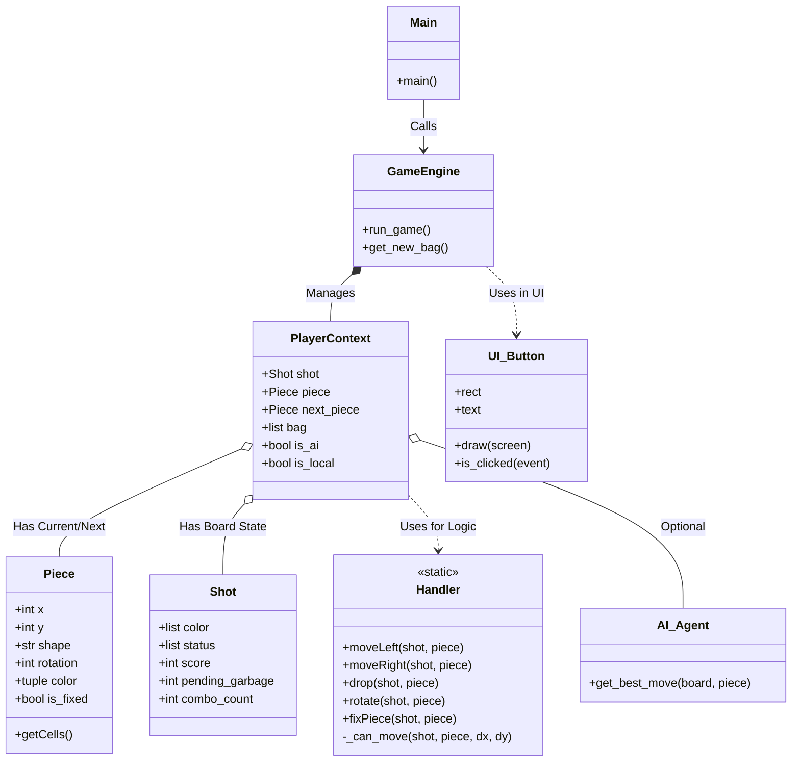

# Tetris Battle - 專案簡報
## Group 14

---

## 1. 遊戲介紹 (Introduction)

### 專案概述
這是一個基於 Python 和 Pygame 開發的俄羅斯方塊對戰遊戲 (Tetris Battle)。除了經典的單人模式外，重點在於實現多人對戰與 AI 對戰功能。

### 主要特色
*   **多種遊戲模式**：
    *   **SOLO**: 單人練習模式
    *   **PVP (Local)**: 本地雙人對戰
    *   **LAN (Network)**: 區域網路連線對戰
    *   **PVE (AI)**: 與電腦 AI 進行對戰
*   **對戰機制**：包含垃圾行 (Garbage Lines) 攻擊系統、B2B (Back-to-Back) 加成。
*   **現代化機制**：7-Bag 方塊生成、Ghost Piece (落點預測)、Hold 功能。

---

## 2. 系統架構 (System Architecture)

### 開發環境
*   **語言**: Python 3.11
*   **核心函式庫**: Pygame (圖形介面與事件處理)
*   **其他工具**: Numpy (AI 矩陣運算), Socket (網路連線)

### 專案結構
*   `main.py`: 程式入口，負責初始化與場景切換。
*   `game_engine.py`: 核心遊戲迴圈，管理遊戲狀態。
*   `pieces.py` & `shots.py`: 定義方塊與棋盤資料結構。
*   `Handler.py`: 負責方塊移動、旋轉與碰撞檢測邏輯。
*   `ai_*.py`: AI 演算法實作。
*   `ui.py` & `menus.py`: 使用者介面與選單系統。

---

## 3. OOP Class Diagram (類別圖)

---

## 4. 核心類別說明 (Key Classes)

### `Piece` (方塊)
*   **職責**: 代表一個正在掉落的俄羅斯方塊。
*   **屬性**: 座標 `(x, y)`、形狀 `shape`、旋轉狀態 `rotation`。
*   **方法**: `getCells()` 取得當前形狀佔用的格點。

### `Shot` (棋盤狀態)
*   **職責**: 儲存遊戲盤面的靜態數據與玩家狀態。
*   **屬性**: 
    *   `status`: 二維陣列，記錄每一格是否有方塊 (0: 空, 2: 固定)。
    *   `color`: 二維陣列，記錄每一格的顏色。
    *   `pending_garbage`: 待接收的垃圾行數量。

### `Handler` (邏輯處理器)
*   **職責**: 處理方塊的移動規則與碰撞檢測。
*   **特性**: 包含多個靜態方法 (Static Methods)，如 `moveLeft`, `rotate`, `fixPiece`。將邏輯與資料 (`Piece`, `Shot`) 分離。

---

## 5. AI 演算法 (AI Implementation)

### 啟發式評估 (Heuristic Evaluation)
AI 透過評估當前盤面的特徵來決定最佳落點。

*   **特徵提取 (`ai_heuristic.py`)**:
    1.  **Landing Height**: 落點高度 (越低越好)。
    2.  **Holes**: 空洞數量 (越少越好)。
    3.  **Row/Col Transitions**: 表面平整度 (越平整越好)。
    4.  **Well Depth**: 豎井深度 (適度保留以消四排)。

*   **決策過程**:
    1.  模擬所有可能的落點與旋轉。
    2.  計算每個結果盤面的分數 (特徵 x 權重)。
    3.  選擇分數最高的移動路徑。

---

## 6. 結論 (Conclusion)

*   本專案成功實作了一個功能完整的俄羅斯方塊對戰遊戲。
*   運用 OOP 物件導向設計，使程式碼結構清晰，易於擴充 (如新增 AI 難度或新模式)。
*   整合了網路通訊與 AI 演算法，提升了遊戲的豐富度與技術挑戰性。

---

## Q & A
